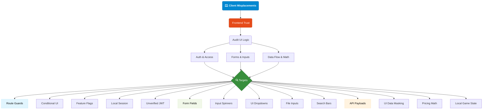

# V3 — Client-Side Security Misplacements

Applications that misplace their trust in frontend client logic rather than backend enforcement. Route guards, feature flags, checkout math, or unverified JWT claims can be bypassed directly by manipulating the browser environment.

Targets: Auth & access navigation, forms & inputs, data flow & math.

---

## Attack Surface Flowchart

---

[<-- Back to full guide: Readme.md](../../Readme.md)
