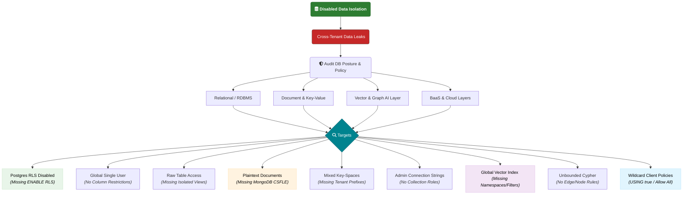

# V4 — Disabled Data Isolation

Cross-tenant data leaks and the failure to enforce proper data boundaries. Policies are missing or disabled across relational DBs (missing RLS), NoSQL layers (shared keyspaces), Vector/Graph databases, and BaaS platforms (wildcard client rules).

Targets: RDBMS, NoSQL/Document & Key-Value, Vector & Graph AI Layer, BaaS & Cloud Layers.

---

## Attack Surface Flowchart

---

[<-- Back to full guide: Readme.md](../../Readme.md)
