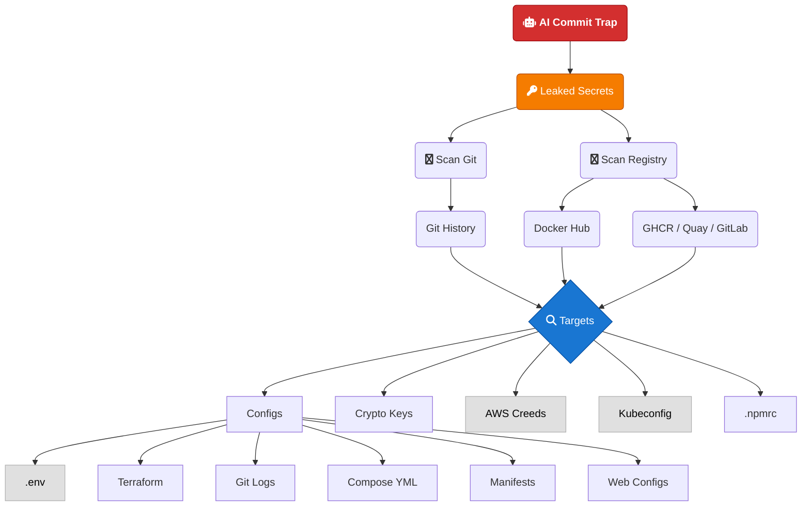

```mermaid
flowchart TD
    Root("fa:fa-robot <b>AI Commit Trap</b>")
    Secrets("fa:fa-key Leaked Secrets")
    ScanGH("fa:fa-github Scan Git")
    ScanCR("fa:fa-docker Scan Registry")
    Git("Git History")
    DockerHub("Docker Hub")
    Gitcontainer("GHCR / Quay / GitLab")

    LookFor{"fa:fa-search Targets"}

    Config["Configs"]
    Env[".env"]
    Terraform["Terraform"]
    GitHist["Git Logs"]
    DockerComp["Compose YML"]
    Deps["Manifests"]
    WebConfig["Web Configs"]
    Certs["Crypto Keys"]
    AWS["AWS Creeds"]
    Kube["Kubeconfig"]
    Npm[".npmrc"]

    %% Connections
    Root --> Secrets
    Secrets --> ScanGH & ScanCR
    ScanGH --> Git
    ScanCR --> DockerHub & Gitcontainer

    Git --> LookFor
    DockerHub --> LookFor
    Gitcontainer --> LookFor

    LookFor --> Config & Certs & AWS & Kube & Npm
    Config --> Env & Terraform & GitHist & DockerComp & Deps & WebConfig

    %% Styling
    style Root color:#FFFFFF, fill:#D32F2F, stroke:#9A0007
    style Secrets color:#FFFFFF, fill:#F57C00, stroke:#BB4D00
    style LookFor color:#FFFFFF, fill:#1976D2, stroke:#004BA0
    style Env color:#000000, fill:#E0E0E0, stroke:#B0B0B0
    style AWS color:#000000, fill:#E0E0E0, stroke:#B0B0B0
    style Kube color:#000000, fill:#E0E0E0, stroke:#B0B0B0
```
