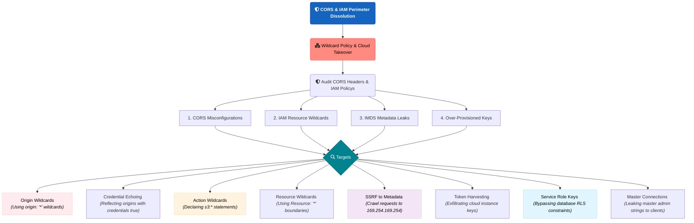

```mermaid
flowchart TD
    Root11("fa:fa-shield-halved <b>CORS & IAM Perimeter Dissolution</b>")
    PerimeterLoss("fa:fa-network-wired Wildcard Policy & Cloud Takeover")
    ScanPerimeter("fa:fa-shield-halved Audit CORS Headers & IAM Policys")

    CorsMisconfig["1. CORS Misconfigurations"]
    IamWildcards["2. IAM Resource Wildcards"]
    ImdsLeak["3. IMDS Metadata Leaks"]
    PaasTokens["4. Over-Provisioned Keys"]

    LookForPerimeter{"fa:fa-search Targets"}

    OriginWildcard["Origin Wildcards <br><i>(Using origin: '*' wildcards)</i>"]
    CredEcho["Credential Echoing <br><i>(Reflecting origins with credentials true)</i>"]

    ActionWildcard["Action Wildcards <br><i>(Declaring s3:* statements)</i>"]
    ResourceWildcard["Resource Wildcards <br><i>(Using Resource: '*' boundaries)</i>"]

    SsrfMetadata["SSRF to Metadata <br><i>(Crawl requests to 169.254.169.254)</i>"]
    TokenHarvesting["Token Harvesting <br><i>(Exfiltrating cloud instance keys)</i>"]

    ServiceRoleBypass["Service Role Keys <br><i>(Bypassing database RLS constraints)</i>"]
    MasterStrings["Master Connections <br><i>(Leaking master admin strings to clients)</i>"]

    %% Connections
    Root11 --> PerimeterLoss
    PerimeterLoss --> ScanPerimeter
    ScanPerimeter --> CorsMisconfig & IamWildcards & ImdsLeak & PaasTokens

    CorsMisconfig --> LookForPerimeter
    IamWildcards --> LookForPerimeter
    ImdsLeak --> LookForPerimeter
    PaasTokens --> LookForPerimeter

    LookForPerimeter --> OriginWildcard & CredEcho
    LookForPerimeter --> ActionWildcard & ResourceWildcard
    LookForPerimeter --> SsrfMetadata & TokenHarvesting
    LookForPerimeter --> ServiceRoleBypass & MasterStrings

    %% Styling
    style Root11 fill:#1565C0, stroke:#0D47A1, color:#FFFFFF
    style PerimeterLoss fill:#FF8A80, stroke:#FF5252, color:#000000
    style LookForPerimeter fill:#00838F, stroke:#005662, color:#FFFFFF
    style OriginWildcard color:#000000, fill:#FFEBEE, stroke:#FFCDD2
    style ActionWildcard color:#000000, fill:#FFF3E0, stroke:#FFE0B2
    style SsrfMetadata color:#000000, fill:#F3E5F5, stroke:#E1BEE7
    style ServiceRoleBypass color:#000000, fill:#E1F5FE, stroke:#B3E5FC
```
