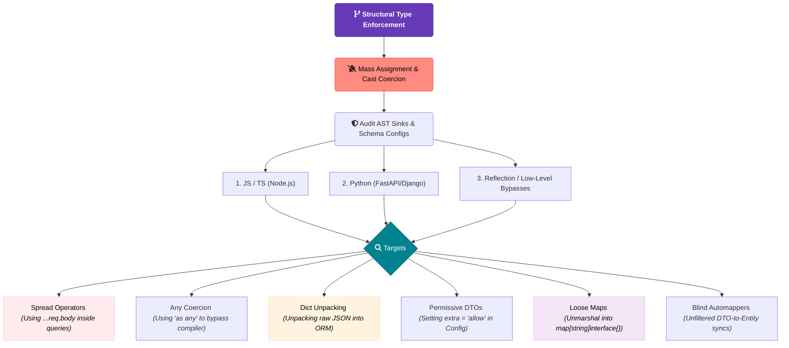

```mermaid
flowchart TD
    %% ==========================================
    %% MAIN ROOT ENGINE
    %% ==========================================
    Root12("fa:fa-code-branch <b>Structural Type Enforcement</b>")
    TypeBypass("fa:fa-bug-slash Mass Assignment & Cast Coercion")
    ScanTypes("fa:fa-shield-halved Audit AST Sinks & Schema Configs")

    %% CATEGORY NODES
    NodeJS["1. JS / TS (Node.js)"]
    Python["2. Python (FastAPI/Django)"]
    CompiledReflection["3. Reflection / Low-Level Bypasses"]

    LookForTypes{"fa:fa-search Targets"}

    %% JS/TS Targets
    SpreadTrap["Spread Operators <br><i>(Using ...req.body inside queries)</i>"]
    AnyCasting["Any Coercion <br><i>(Using 'as any' to bypass compiler)</i>"]

    %% Python Targets
    DictUnpacking["Dict Unpacking <br><i>(Unpacking raw JSON into ORM)</i>"]
    PermissivePydantic["Permissive DTOs <br><i>(Setting extra = 'allow' in Config)</i>"]

    %% Reflection Targets
    LooseMaps["Loose Maps <br><i>(Unmarshal into map[string]interface{})</i>"]
    Automappers["Blind Automappers <br><i>(Unfiltered DTO-to-Entity syncs)</i>"]

    %% ==========================================
    %% CONNECTIONS
    %% ==========================================
    Root12 --> TypeBypass
    TypeBypass --> ScanTypes
    ScanTypes --> NodeJS & Python & CompiledReflection

    NodeJS --> LookForTypes
    Python --> LookForTypes
    CompiledReflection --> LookForTypes

    LookForTypes --> SpreadTrap & AnyCasting
    LookForTypes --> DictUnpacking & PermissivePydantic
    LookForTypes --> LooseMaps & Automappers

    %% ==========================================
    %% GRAPH STYLING
    %% ==========================================
    style Root12 fill:#673AB7, stroke:#4527A0, color:#FFFFFF
    style TypeBypass fill:#FF8A80, stroke:#FF5252, color:#000000
    style LookForTypes fill:#00838F, stroke:#005662, color:#FFFFFF
    
    style SpreadTrap color:#000000, fill:#FFEBEE, stroke:#FFCDD2
    style DictUnpacking color:#000000, fill:#FFF3E0, stroke:#FFE0B2
    style LooseMaps color:#000000, fill:#F3E5F5, stroke:#E1BEE7
```
