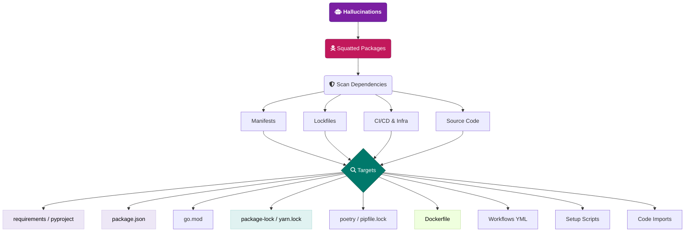

# V2 — Package Hallucination

A unique AI-era vulnerability where LLMs "hallucinate" non-existent software packages. Malicious actors scan for these common hallucinations and squat on those names in package registries. If a developer uses the AI's hallucinated code, their manifests and lockfiles pull down malicious payloads.

Targets: dependency manifests, lockfiles, CI/CD & infra, source code imports.

---

## Attack Surface Flowchart

