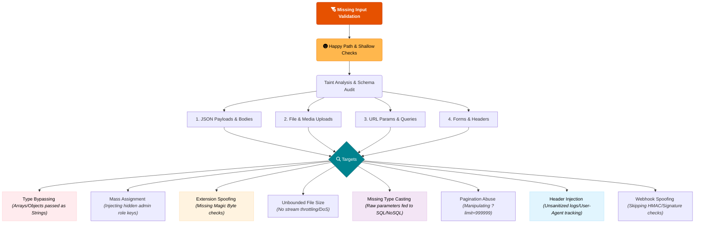

```mermaid
flowchart TD
    Root5("fa:fa-filter-circle-xmark <b>Missing Input Validation</b>")
    HappyPath("fa:fa-face-smile Happy Path & Shallow Checks")
    ScanValidation("fa:fa-magnifying-glass-shield Taint Analysis & Schema Audit")

    JSONPayloads["1. JSON Payloads & Bodies"]
    ValidationFileUploads["2. File & Media Uploads"]
    URLParams["3. URL Params & Queries"]
    FormsHeaders["4. Forms & Headers"]

    LookForValid1{"fa:fa-search Targets"}

    TypeBypass["Type Bypassing <br><i>(Arrays/Objects passed as Strings)</i>"]
    ExtraKeys["Mass Assignment <br><i>(Injecting hidden admin role keys)</i>"]

    MagicBytes["Extension Spoofing <br><i>(Missing Magic Byte checks)</i>"]
    UnboundedSize["Unbounded File Size <br><i>(No stream throttling/DoS)</i>"]

    RawCasting["Missing Type Casting <br><i>(Raw parameters fed to SQL/NoSQL)</i>"]
    LimitExploit["Pagination Abuse <br><i>(Manipulating ?limit=999999)</i>"]

    HeaderInj["Header Injection <br><i>(Unsanitized logs/User-Agent tracking)</i>"]
    WebhookSpoof["Webhook Spoofing <br><i>(Skipping HMAC/Signature checks)</i>"]

    %% Connections
    Root5 --> HappyPath
    HappyPath --> ScanValidation
    ScanValidation --> JSONPayloads & ValidationFileUploads & URLParams & FormsHeaders

    JSONPayloads --> LookForValid1
    ValidationFileUploads --> LookForValid1
    URLParams --> LookForValid1
    FormsHeaders --> LookForValid1

    LookForValid1 --> TypeBypass & ExtraKeys
    LookForValid1 --> MagicBytes & UnboundedSize
    LookForValid1 --> RawCasting & LimitExploit
    LookForValid1 --> HeaderInj & WebhookSpoof

    %% Styling
    style Root5 fill:#E65100, stroke:#BF360C, color:#FFFFFF
    style HappyPath fill:#FFB74D, stroke:#F57C00, color:#000000
    style LookForValid1 fill:#00838F, stroke:#005662, color:#FFFFFF
    style TypeBypass color:#000000, fill:#FFEBEE, stroke:#FFCDD2
    style MagicBytes color:#000000, fill:#FFF3E0, stroke:#FFE0B2
    style RawCasting color:#000000, fill:#F3E5F5, stroke:#E1BEE7
    style HeaderInj color:#000000, fill:#E1F5FE, stroke:#B3E5FC
```
