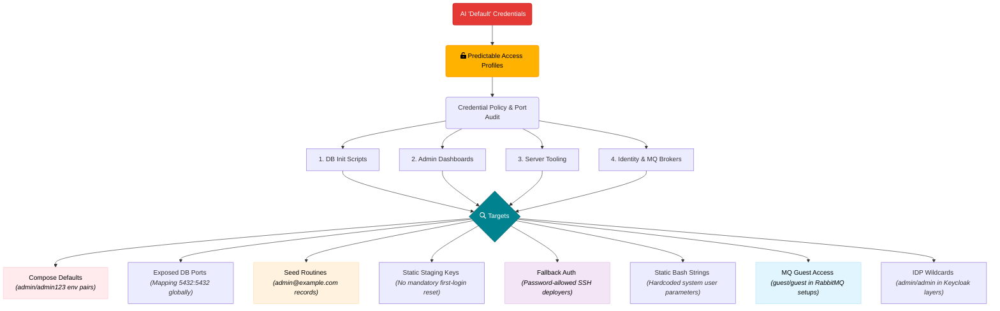

```mermaid
flowchart TD
    Root7("fa:fa-shield-crack AI 'Default' Credentials")
    BruteForce("fa:fa-unlock-keyhole Predictable Access Profiles")
    ScanCreds("fa:fa-magnifying-glass-shield Credential Policy & Port Audit")

    DbInit["1. DB Init Scripts"]
    AdminDash["2. Admin Dashboards"]
    SrvMgmt["3. Server Tooling"]
    Brokers["4. Identity & MQ Brokers"]

    LookForDefaults{"fa:fa-search Targets"}

    ComposeDefaults["Compose Defaults <br><i>(admin/admin123 env pairs)</i>"]
    ExposedPorts["Exposed DB Ports <br><i>(Mapping 5432:5432 globally)</i>"]

    SeedRoutines["Seed Routines <br><i>(admin@example.com records)</i>"]
    MissingForceChange["Static Staging Keys <br><i>(No mandatory first-login reset)</i>"]

    FallbackAuth["Fallback Auth <br><i>(Password-allowed SSH deployers)</i>"]
    StaticShells["Static Bash Strings <br><i>(Hardcoded system user parameters)</i>"]

    MqGuest["MQ Guest Access <br><i>(guest/guest in RabbitMQ setups)</i>"]
    IdpAdmin["IDP Wildcards <br><i>(admin/admin in Keycloak layers)</i>"]

    %% Connections
    Root7 --> BruteForce
    BruteForce --> ScanCreds
    ScanCreds --> DbInit & AdminDash & SrvMgmt & Brokers

    DbInit --> LookForDefaults
    AdminDash --> LookForDefaults
    SrvMgmt --> LookForDefaults
    Brokers --> LookForDefaults

    LookForDefaults --> ComposeDefaults & ExposedPorts
    LookForDefaults --> SeedRoutines & MissingForceChange
    LookForDefaults --> FallbackAuth & StaticShells
    LookForDefaults --> MqGuest & IdpAdmin

    %% Styling
    style Root7 fill:#E53935, stroke:#B71C1C, color:#FFFFFF
    style BruteForce fill:#FFB300, stroke:#FF8F00, color:#000000
    style LookForDefaults fill:#00838F, stroke:#005662, color:#FFFFFF
    style ComposeDefaults color:#000000, fill:#FFEBEE, stroke:#FFCDD2
    style SeedRoutines color:#000000, fill:#FFF3E0, stroke:#FFE0B2
    style FallbackAuth color:#000000, fill:#F3E5F5, stroke:#E1BEE7
    style MqGuest color:#000000, fill:#E1F5FE, stroke:#B3E5FC
```
