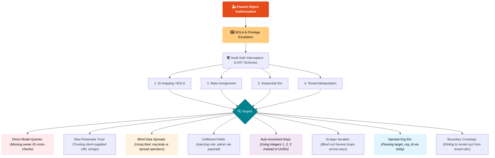

```mermaid
flowchart TD
    Root9("fa:fa-user-shield <b>Flawed Object Authorization</b>")
    PrivLeak("fa:fa-users-rectangle BOLA & Privilege Escalation")
    ScanAuthz("fa:fa-shield-halved Audit Auth Interceptors & AST Schemes")

    IdHopping["1. ID Hopping / BOLA"]
    MassAssign["2. Mass Assignment"]
    SeqIds["3. Sequential IDs"]
    TenantManip["4. Tenant Manipulation"]

    LookForAuthz{"fa:fa-search Targets"}

    MissingOwnership["Direct Model Queries <br><i>(Missing owner ID cross-checks)</i>"]
    UrlParams["Raw Parameter Trust <br><i>(Trusting client-supplied URL strings)</i>"]

    SpreadUpdates["Blind Data Spreads <br><i>(Using $set: req.body or spread operators)</i>"]
    RoleEscalation["Unfiltered Fields <br><i>(Injecting role: admin via payload)</i>"]

    AutoIncrement["Auto-Increment Keys <br><i>(Using integers 1, 2, 3 instead of UUIDs)</i>"]
    ScraperLoops["Scraper Iteration <br><i>(Blind curl harvest loops across keys)</i>"]

    CrossOrgPayloads["Injected Org IDs <br><i>(Passing target_org_id via body)</i>"]
    IsolationBypass["Boundary Crossings <br><i>(Writing to tenant-xyz from tenant-abc)</i>"]

    %% Connections
    Root9 --> PrivLeak
    PrivLeak --> ScanAuthz
    ScanAuthz --> IdHopping & MassAssign & SeqIds & TenantManip

    IdHopping --> LookForAuthz
    MassAssign --> LookForAuthz
    SeqIds --> LookForAuthz
    TenantManip --> LookForAuthz

    LookForAuthz --> MissingOwnership & UrlParams
    LookForAuthz --> SpreadUpdates & RoleEscalation
    LookForAuthz --> AutoIncrement & ScraperLoops
    LookForAuthz --> CrossOrgPayloads & IsolationBypass

    %% Styling
    style Root9 fill:#E64A19, stroke:#D84315, color:#FFFFFF
    style PrivLeak fill:#FFCC80, stroke:#FFA726, color:#000000
    style LookForAuthz fill:#00838F, stroke:#005662, color:#FFFFFF
    style MissingOwnership color:#000000, fill:#FFEBEE, stroke:#FFCDD2
    style SpreadUpdates color:#000000, fill:#FFF3E0, stroke:#FFE0B2
    style AutoIncrement color:#000000, fill:#F3E5F5, stroke:#E1BEE7
    style CrossOrgPayloads color:#000000, fill:#E1F5FE, stroke:#B3E5FC
```
