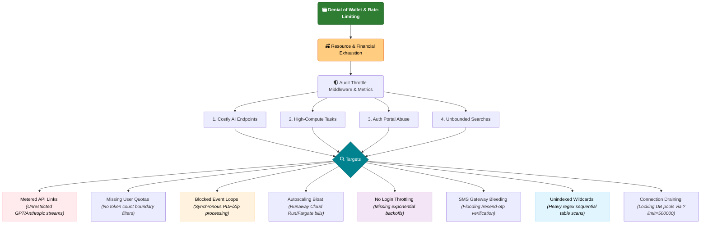

# V9 — Denial of Wallet & Rate-Limiting

Financial and resource exhaustion by leveraging unmetered boundaries. Attackers hit costly AI endpoints without user quotas, run blocking synchronous loops for compute-heavy tasks, trigger cloud-autoscaling bloat, and perform credential stuffing or SMS pumping on unrestricted auth endpoints.

Targets: costly AI endpoints, high-compute tasks, auth portal abuse, unbounded searches.

---

## Attack Surface Flowchart

